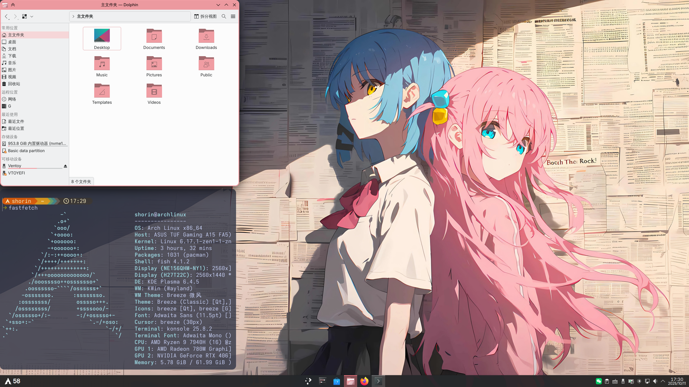
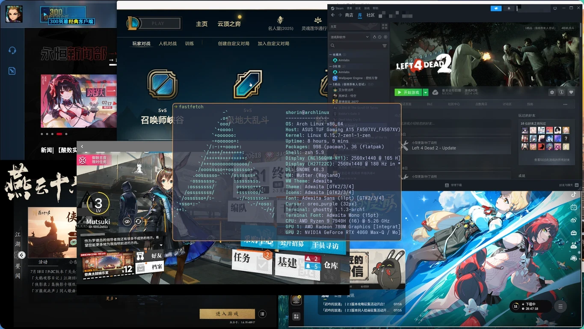
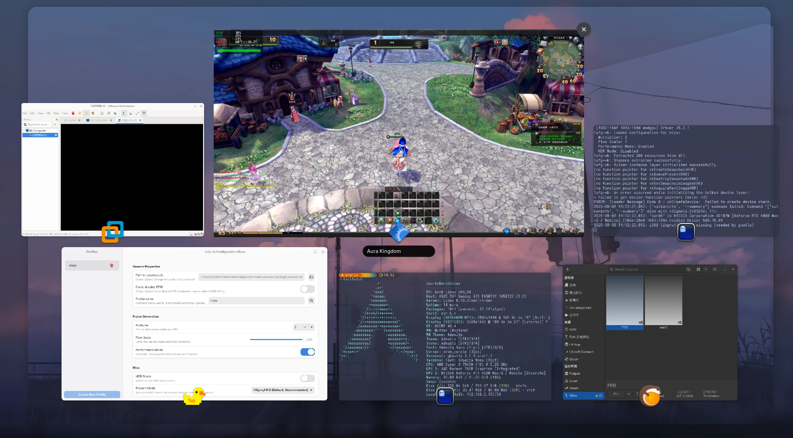
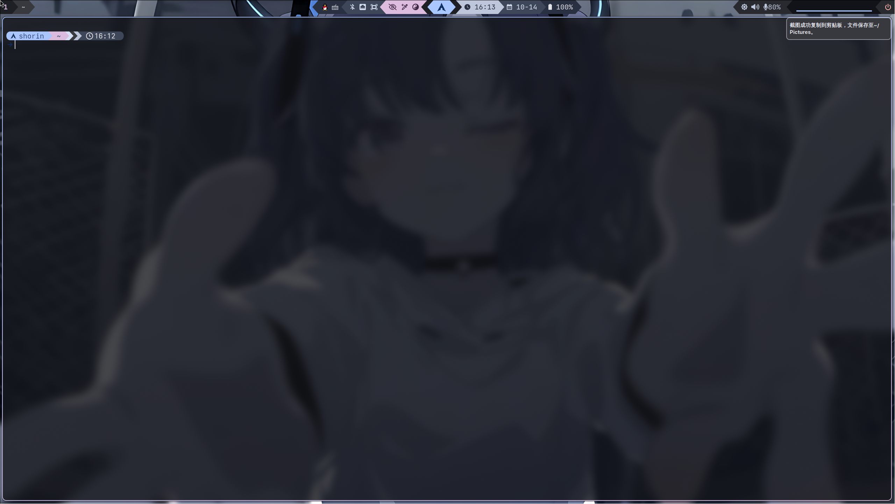
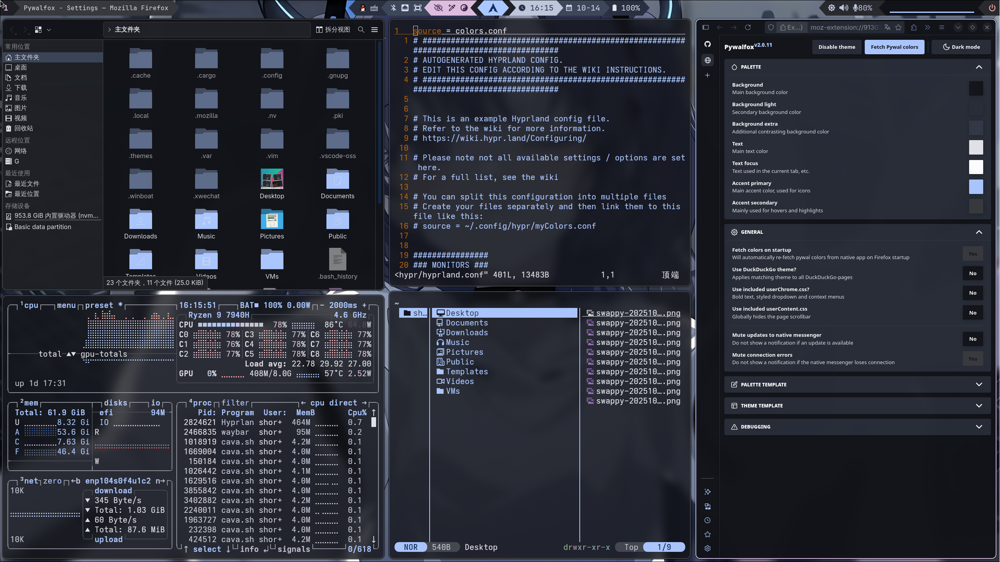
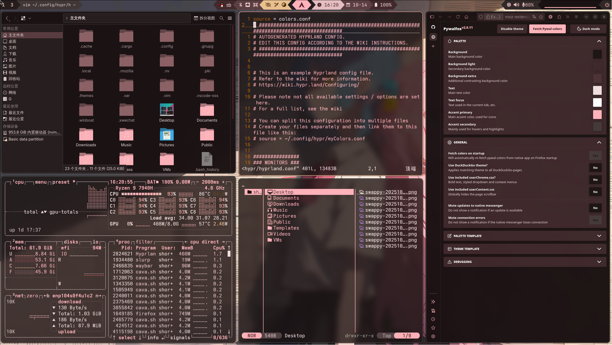

本文是我使用Archlinux的经历，可以当作教程来看，以我个人用着舒服为标准。

使用btrfs文件系统，不涉及加密和安全启动。具体内容包括：系统的手动和脚本安装、win+linux双系统、N卡驱动、GNOME和KDE Plasma桌面环境、Hyprland和Niri、中文输入法、常用虚拟机程序（vmware、virtualbox、winapps、distrobox、qemu/kvm）、虚拟机安装windows、qemu/kvm虚拟机显卡直通、虚拟机调优和伪装、Linux玩游戏、系统性能调优等等，最后一步干净删除Linux系统。

文档有点长了，难免会有错漏，如果发现有错别字或者有错误的地方可以帮忙提交一下。

## [Wiki-文档本体在这里](https://github.com/SHORiN-KiWATA/ShorinArchExperience-ArchlinuxGuide/wiki)

10-17日开始新增了Hyprland和Niri相关内容。

## 视频

这里有一些我制作的视频，可以当作电子榨菜。除去第一期archlinux教程视频，其他视频都以故事为明线，教学作为暗线，图一乐的同时学习Linux的使用方法。更多视频制作中🏗……

### Archlinux究极指南2025

本文档创建时制作的视频，虽然已经过时，专业知识浅薄，制作也十分粗糙，但是依旧能学到东西，有兴趣的可以看看： [「Archlinux究极指南」从手动安装到显卡直通，最后删除Linux_哔哩哔哩_bilibili](https://www.bilibili.com/video/BV1L2gxzVEgs/?spm_id_from=333.1387.homepage.video_card.click&vd_source=65a8f230813d56660e48ae1afdfa4182)

### 挑战Linux玩游戏

[「Linux游戏指南」关于Linux玩游戏的一切](https://www.bilibili.com/video/BV1zyttzPEmp/?share_source=copy_web)

### 纯小白在禁止使用终端的情况下体验Linux

[「女友体验Linux」 全程禁用命令行，颠覆刻板印象，纯小白也能轻松上手！](https://www.bilibili.com/video/BV1YvenzUEFf/?share_source=copy_web)

## 一些截图

### 我的KDE桌面

### Linux玩游戏

### 小黄鸭补帧 VMware虚拟机网游单机版 wine兼容层运行旧游戏

### 我的niri/hyprland配置

- Waybar

- matugen基于壁纸生成主题颜色

